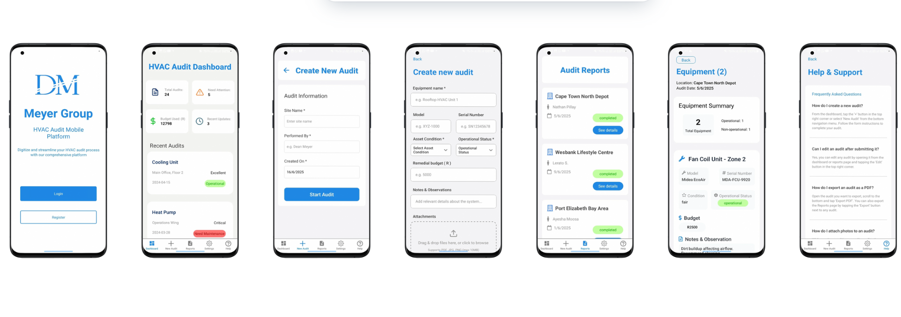

# HVAC Audit App 📋❄️

A modern mobile app for conducting and managing HVAC asset audits, built with **React Native**, **Expo SDK 53**, and **Firebase**. Developed by Meyer.dev.

---

## 🧩 Overview

This app was created to streamline HVAC audit workflows for field technicians and facilities managers. It digitizes traditional HVAC audit reports, enabling real-time asset tracking, audit submissions, and report access — all from a mobile device.

Whether used in a commercial building, server room, or industrial environment, this app helps auditors quickly capture asset data, view statuses, and monitor conditions.

---

## 🚀 Features

- 🔐 **User Authentication** – Secure login & registration using Firebase Auth.
- 🏢 **Audit Dashboard** – View all submitted audits by condition, status, date, and location.
- 📝 **Create New Audit** – Fill in audit details and save them to Firebase Firestore.
- 📦 **Asset Condition Tracking** – Displays operational status and critical alerts.
- ⚙️ **Real-Time Firestore Integration** – Instant save/load of audits.
- 🧠 **Built with TypeScript** – For better scalability and maintainability.
- 📱 **Optimized for Tablets and Phones** – Field-friendly UI for inspectors and engineers.
- 🎨 **Custom Branding** – Designed with a minimalist logo and a clean interface (Meyer.dev).

---

## 🛠️ Tech Stack

- **Framework**: React Native (with Expo SDK 53)
- **TypeScript**
- **Firebase**: Firestore Database
- **Navigation**: Expo Router
- **Styling**: Tailwind CSS (via NativeWind)
- **State Management**: useState, useEffect
- **Icons**: Expo Vector Icons
- **Font Loading**: expo-font


---

## 📂 Project Structure

/components         → Reusable UI components (e.g., Cards, Headers)

/app , /app/(tabs)  → App screens (Welcome, Login, Register, Dashboard, Audit Form)

/assets             → Fonts, icons, and the custom Meyer.dev logo

/utils              → Sample mock data & helpers

/app/index.tsx      → Entry point with navigation

---

## ⚙️ Setup Instructions

> Make sure you have Node.js, Expo CLI, and Firebase Project Credentials set up.
> 

```bash
# 1. Clone the repository
git clone <https://github.com/meyer-dev/hvac-audit-app.git>

# 2. Navigate to project
cd hvac-audit-app

# 3. Install dependencies
npm install

# 4. Start the Expo server
npx expo start

```

You can scan the QR code with **Expo Go** to test the app on your physical device.

---

## 🔐 Firebase Setup

1. Create a Firebase project at https://console.firebase.google.com
2. Enable **Authentication (Email/Password)**
3. Create a **Firestore** database
4. Add your Firebase config to the root folder
5. Ensure Firebase rules are set to allow authenticated reads/writes

---

## 📸 Screenshots

> 
> 
- Welcome Screen
- Dashboard with audits
- Create New Audit Form
- Add Equipment Form
- Audit Reports
- View Audit Details
- Help & Support

---

## 🧾 Business Use

This app is available for licensing and customization for HVAC, mechanical engineering, and facilities management companies.

If you're interested in using it for your operations or want a custom version, reach out via LinkedIn or email.

---

## 🤝 Contact

**Developer:** Dean Meyer  
📧 meyerdean.developer@gmail.com  
🔗 [LinkedIn](https://www.linkedin.com/in/dean-meyer-385342247/)  
🌐 [Portfolio](https://meyer-dev.netlify.app/)

---

## 📜 License

This project is protected and intended for client or educational use. Please do not resell, duplicate, or claim the code as your own without permission.

---

## ⭐️ Support My Work

If this project inspired you or helped you, feel free to leave a ⭐ on the repo!